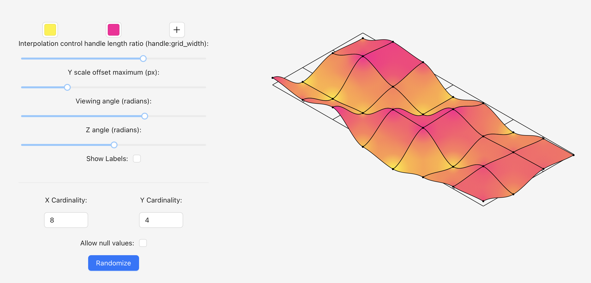
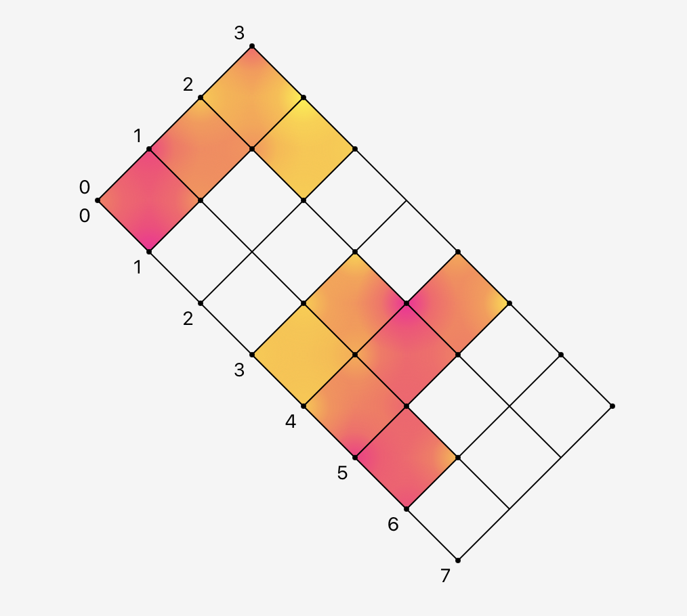

# IsoChart

IsoChart is an isometric 3D SVG chart component written with React. The component has intuitive interactions and is customizable.

# To-Do

There's still quite a bit of work to do to make this, but the component covers what we need. Some things to add:

-   Vertical axis and labels.
-   Grid passthrough when negative values used.
-   Fix deltaX and deltaY: the chart slightly overflows the svg.
